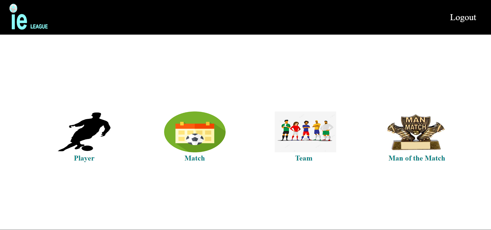
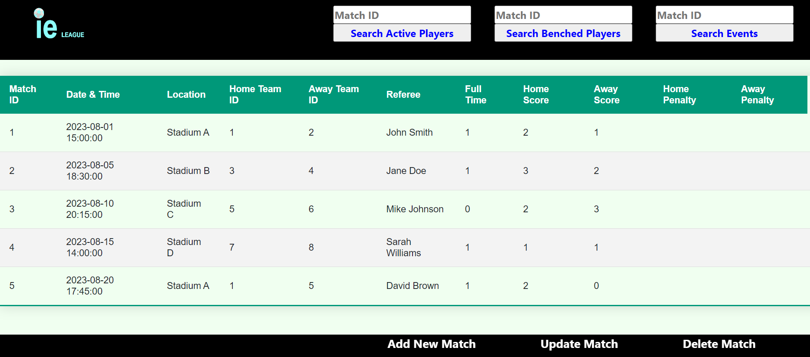

# Football League Database Management System

This is a Football League Database Management System developed using PHP, HTML, CSS, and MySQL. The system allows users to manage and view information about football teams, matches, players, contracts, events, and more. It offers different functionalities for admin and regular users, including data manipulation and search capabilities.

## Features

- User Roles: Admin and User
- Admin Capabilities:
  - Add, Update, and Delete Teams, Matches, Players, Contracts, and Events
  - Search functionality for Players, Teams, Events and Matches
- User Capabilities:
  - View Teams, Matches, Players, Contracts, Man of the Match and Events
  - Search functionality for Players, Teams, Events and Matches

## Prerequisites

- XAMPP installed on your local machine

## Installation

1. Clone this repository to your local machine.
2. Navigate to the `Football_DB` folder and move it to the `htdocs` directory of your XAMPP installation.
3. Navigate to the `fmdb` folder and move it to the `xampp/mysql/data` directory.
4. If in case the database doesnot work or you prefer to create the tables manually, follow these steps:
   - Start xampp application. Start Apache and MySQL. 
   - Open your web browser and go to `http://localhost/phpmyadmin/`.
   - Create a new database named `fmdb`.
   - Inside the `fmdb_sql` folder, you'll find SQL queries to create tables and add initial entries. Execute these queries in the `fmdb` database.

## Usage

1. Start XAMPP and ensure that Apache and MySQL are running.
2. Open your web browser and go to `http://localhost/Football_DB`.
3. If you're an admin user, you'll have access to the full range of functionalities for managing the database. Regular users can view data and perform searches.
4. Log in using your credentials to access the system.
5. Explore the different sections, perform searches, and manage data based on your role.

